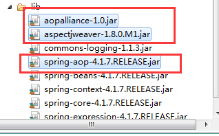
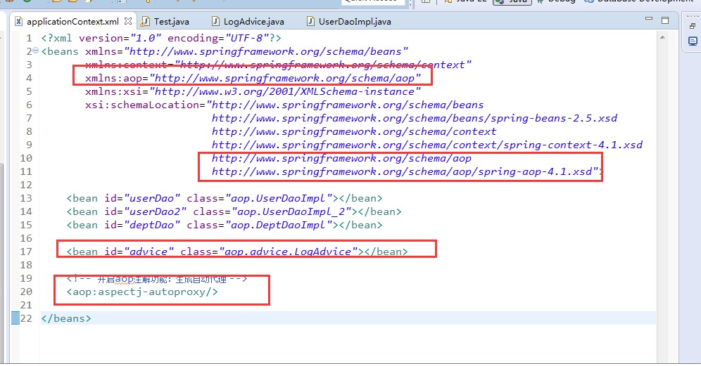
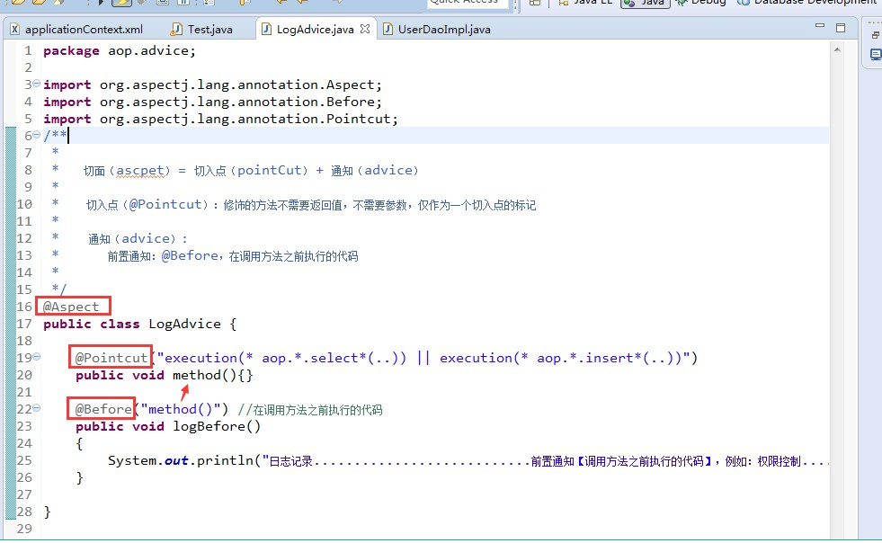
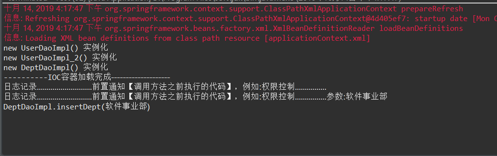

# AOP注解配置

### 前置通知

#### 1.导入对应的jar包 并添加到内路径



#### 2. aop包内的Java代码准备就位

```Java
package aop;


public class DeptDaoImpl implements IDeptDao {

	public DeptDaoImpl()
	{
		System.out.println("new DeptDaoImpl() 实例化");
	}
	
	@Override
	public void selectDept() {
		//System.out.println("DeptDaoImpl.selectDept()............日志记录开始");
		
		System.out.println("DeptDaoImpl.selectDept..........软件开发事业部11111");
		
		//System.out.println("DeptDaoImpl.selectDept()............日志记录结束");
	}

	@Override
	public boolean insertDept(String deptname) {
		//System.out.println("DeptDaoImpl.insertDept("+deptname+")............日志记录开始");
		
		System.out.println("DeptDaoImpl.insertDept("+deptname+")");
		
		//System.out.println("DeptDaoImpl.insertDept()............日志记录开始,返回结果：" + true);
		
		return true;
	}
}
```

```Java
package aop;


public interface IDeptDao {

	public void selectDept();
	
	public boolean insertDept(String deptname);
}

```

```Java
package aop;


public interface IUserDao {

	public void selectUser();
	
	public boolean insertUser(String username);
}

```

```Java
package aop;


public class UserDaoImpl_2 implements IUserDao {

	public UserDaoImpl_2()
	{
		System.out.println("new UserDaoImpl_2() 实例化");
	}
	
	@Override
	public void selectUser() {
		//System.out.println("UserDaoImpl_2.selectUser()............日志记录开始");
		
		System.out.println("UserDaoImpl_2.selectUser..........玉艺22222");
		
		//System.out.println("UserDaoImpl_2.selectUser()............日志记录结束");
	}

	@Override
	public boolean insertUser(String username) {
		//System.out.println("UserDaoImpl_2.insertUser("+username+")............日志记录开始");
		
		System.out.println("UserDaoImpl_2.insertUser("+username+")");
		
		//System.out.println("UserDaoImpl_2.insertUser()............日志记录开始,返回结果：" + true);
		
		return true;
	}
}

```

```Java
package aop;


public class UserDaoImpl implements IUserDao {

	public UserDaoImpl()
	{
		System.out.println("new UserDaoImpl() 实例化");
	}
	
	@Override
	public void selectUser() {
		//System.out.println("UserDaoImpl.selectUser()............日志记录开始");
		
		System.out.println("UserDaoImpl.selectUser..........杰成11111");
		
		//System.out.println("UserDaoImpl.selectUser()............日志记录结束");
	}

	@Override
	public boolean insertUser(String username) {
		//System.out.println("UserDaoImpl.insertUser("+username+")............日志记录开始");
		
		System.out.println("UserDaoImpl.insertUser("+username+")");
		
		//System.out.println("UserDaoImpl.insertUser()............日志记录开始,返回结果：" + true);
		
		return true;
	}
}

```

#### applicationContext.xml配置



```xml
<?xml version="1.0" encoding="UTF-8"?>
<beans xmlns="http://www.springframework.org/schema/beans"
	   xmlns:context="http://www.springframework.org/schema/context"
	   xmlns:aop="http://www.springframework.org/schema/aop"
	   xmlns:xsi="http://www.w3.org/2001/XMLSchema-instance"
	   xsi:schemaLocation="http://www.springframework.org/schema/beans 
	                       http://www.springframework.org/schema/beans/spring-beans-2.5.xsd
	                       http://www.springframework.org/schema/context
	                       http://www.springframework.org/schema/context/spring-context-4.1.xsd
	                       http://www.springframework.org/schema/aop
	                       http://www.springframework.org/schema/aop/spring-aop-4.1.xsd">

	<bean id="userDao" class="aop.UserDaoImpl"></bean>
	<bean id="userDao2" class="aop.UserDaoImpl_2"></bean>
	<bean id="deptDao" class="aop.DeptDaoImpl"></bean>
	
	<bean id="advice" class="aop.advice.LogAdvice"></bean>
	
	<!-- 开启aop注解功能:生成自动代理 -->
	<aop:aspectj-autoproxy/>
	
</beans>
```

#### 书写注解配置代码以及测试代码



```Java
package aop.advice;

import org.aspectj.lang.annotation.Before;
import org.aspectj.lang.annotation.Pointcut;

/**
 * 
* <p>Title: LogAdvice</p>  
* <p>
*	Description: 
*   切面(ascpet) = 切入点(pointCut) + 通知(advice)
*   
*   切入点(@Pointcut):修饰的方法不需要返回值，不需要参数，仅作为一个切入点的标记
*   
*   通知(advice)
*   	前置通知:@Before,在调用方法之前执行的代码
* </p> 
* @author xianxian 
* @date 2019年10月14日
 */
@Aspect
public class LogAdvice {

	@Pointcut("execution(* aop.*.select*(..)) || execution(* aop.*.insert*(..))")
	public void method() {}
	
	@Before("method()")//在调用方法之前执行代码
	public void logBefore() {
		System.out.println("日志记录............................前置通知【调用方法之前执行的代码】，例如:权限控制................");
	}
}

```

```Java
package aop;


import org.springframework.context.support.ClassPathXmlApplicationContext;

public class Test {

	public static void main(String[] args){

		//1.加载并且解析applicationContext.xml
		//积极加载，在加载与解析xml的同时，即完成所有bean的实例化
		ClassPathXmlApplicationContext factory = new ClassPathXmlApplicationContext("applicationContext.xml");
		
		System.out.println("----------IOC容器加载完成--------------------");
		
		//2.无代理，无日志记录
		IUserDao userDao = (IUserDao) factory.getBean("userDao");
		IUserDao userDao2 = (IUserDao) factory.getBean("userDao2");
		IDeptDao deptDao = (IDeptDao) factory.getBean("deptDao");
		
		userDao.selectUser();
		userDao2.selectUser();
		deptDao.selectDept();;
		
		deptDao.insertDept("软件事业部");
	}

}

```

#### 运行测试




###  后置通知
